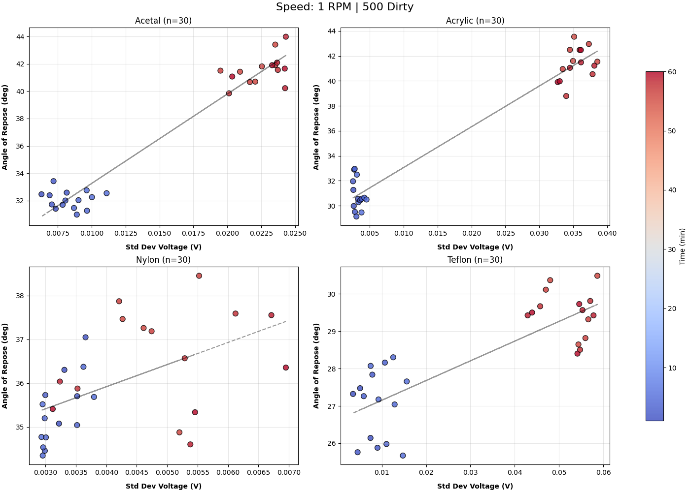
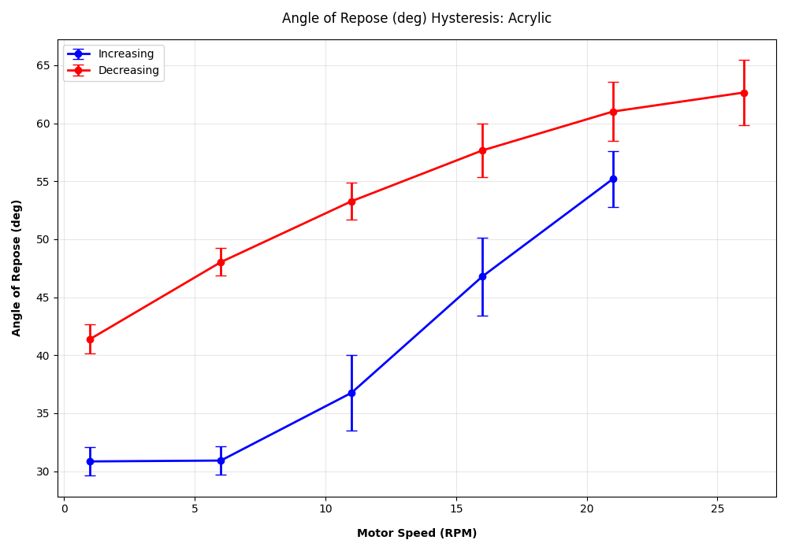
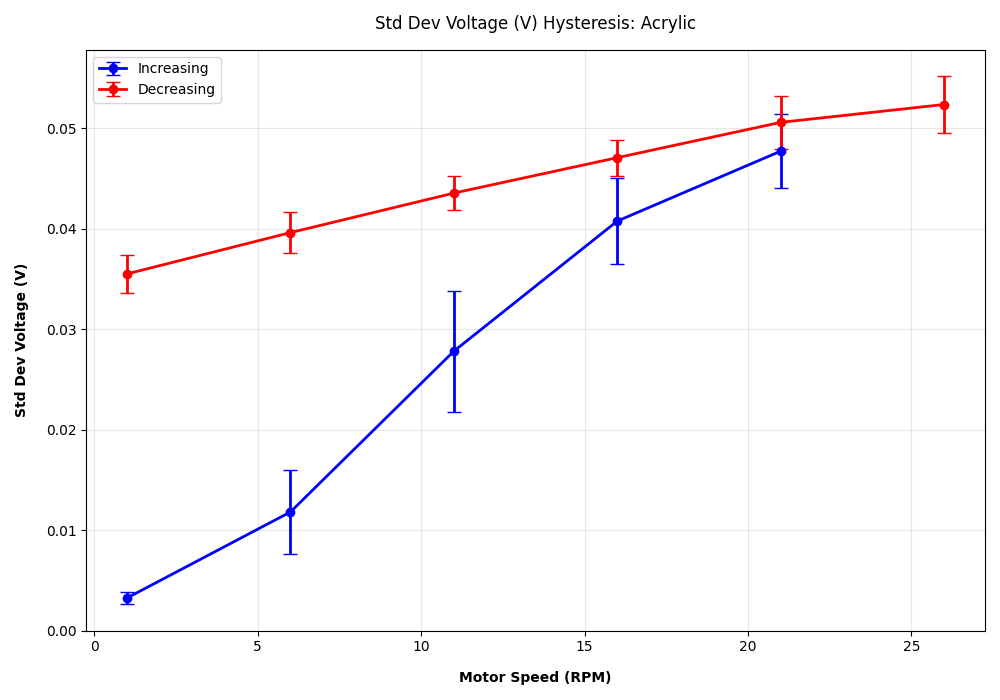
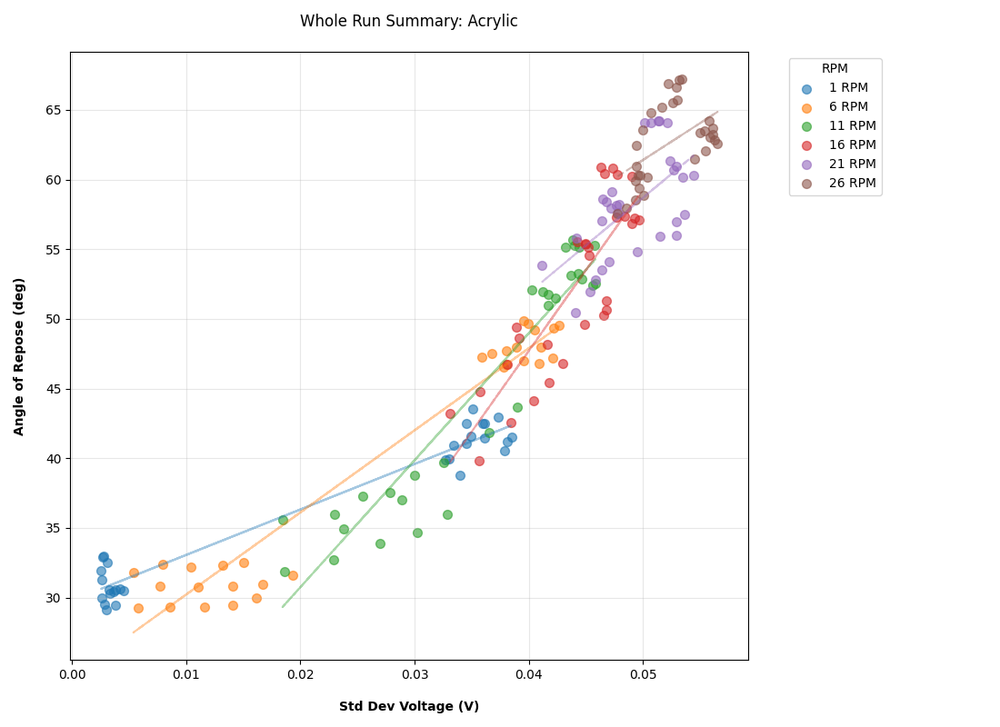
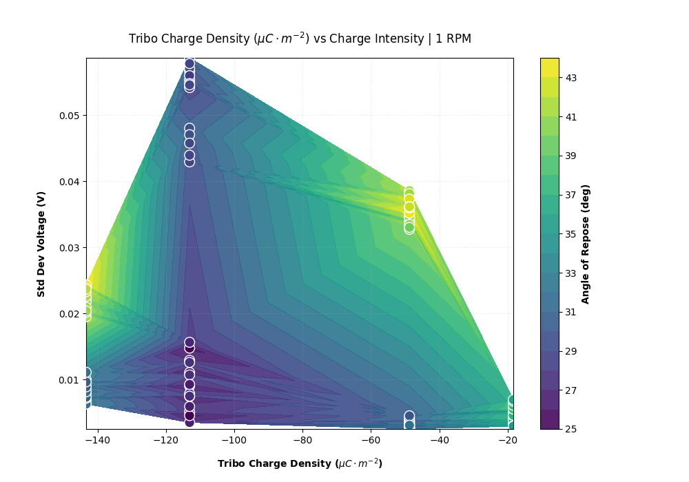
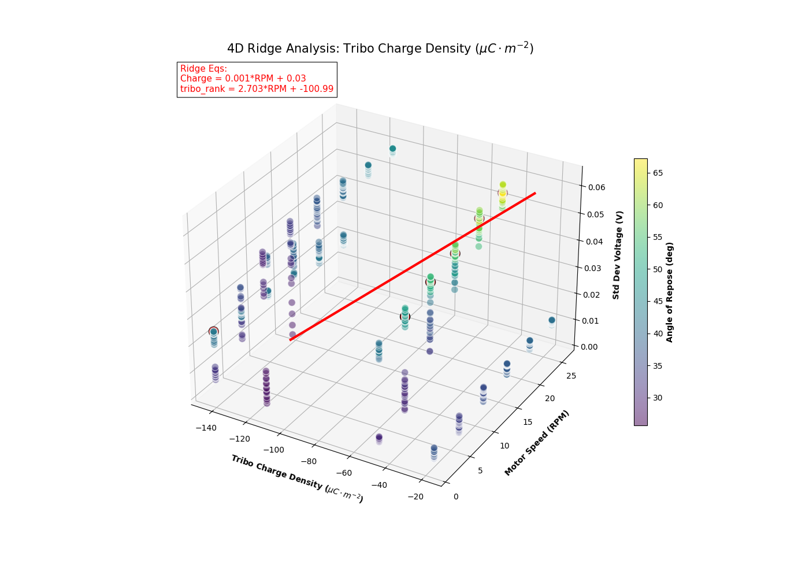

# Particle Electrostatics Analysis

This repository serves as the central hub for the scripts used to process experimental data and the resulting visualizations. It provides a comprehensive analysis of particle behavior within a rotating drum, specifically focusing on the intersection of motion and electrostatic charging.

**Companion Repository:** The scripts used for data capture are located at [particle-electrostatics-exp](https://github.com/ben-e-christensen/particle-electrostatics-exp).

## 🧪 Experimental Design
The experiment observes a particle bed in a spinning drum as it iterates through a specific speed profile. 

* **Speed Profile:** The drum cycles through **1, 6, 11, 16, 21, and 26 RPM**, then descends in reverse order back to **1 RPM**.
* **Trial Durations:**
    * **12-minute runs:** Each speed step is held for 1 minute.
    * **60-minute runs:** Each speed step is held for 5 minutes.
* **Conditions:** Data is categorized into **Dirty** (beads used as-is) or **Clean** (beads stripped of dust, oils, and grime) to identify how surface contaminants influence charging behavior.

## 📊 Visualization Suite

The analysis generates five primary categories of visualizations to describe the relationships between motion, charge intensity, and the angle of repose.

### 1. Grids by Speed
These grids isolate behavior at a specific RPM during both the increasing and decreasing legs of a run.
* **Data Point:** Each point represents the average over a one-minute bin.
* **Color Coding:** Signifies the time elapsed since the start of the experiment to track temporal drift.

### 2. Hysteresis Plots
These plots provide a clear comparison of particle behavior during acceleration vs. deceleration.
* **Metric types:** Includes Hysteresis for both **Angle of Repose** and **Std Dev Voltage (V)**.
* **Features:** Error bars are added to each data point for statistical clarity.

| Angle Hysteresis | Charge Hysteresis |
|:---:|:---:|
|  |  |

### 3. Plot Summaries
This graph takes data from the speed grids and aggregates a single material type onto one axis.
* **Utility:** Includes lines of best fit for each RPM to easily visualize how the bed behaves across the entire speed range.

### 4. Correlation Contours
These heatmaps visualize how intrinsic material properties influence experimental outcomes.
* **Variables:** Analyzes **Collapse Count** (avalanches per minute), **Density**, **Resistivity**, and [Triboelectric Charge Density (TECD)](https://pmc.ncbi.nlm.nih.gov/articles/PMC6441076/).
* **Hypothesis:** By looking at materials under identical conditions, we can isolate which intrinsic properties describe behavioral differences.

### 5. 4D Ridge Analysis
A high-dimensional representation of the contour data, tracking the "ridge" of peak repose angles as a function of material property, motor speed, and electrostatic charge.

## 📂 Directory Structure
All output is contained within the `Graphs/` directory, organized by cleaning condition and trial configuration:
* `Graphs/`
    * `Dirty/`
    * `Clean/`
        * `[Count]-[Condition]-[Duration]-graphs/`

---
*Developed by Ben Christensen*